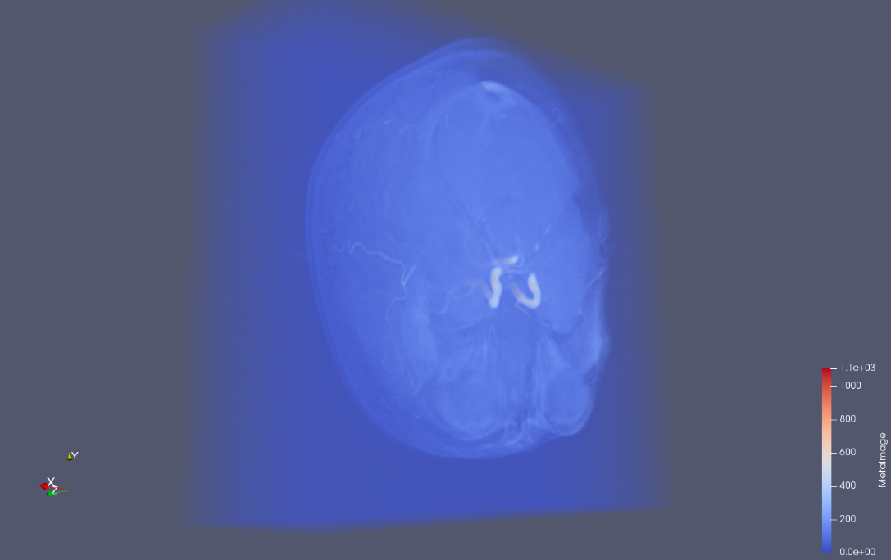

# Contextual Visualization of Magnetic Resonance Angiography (MRA)

## Team members

* Farshad Mogharrabi (u1074636)
* Karthik Karanth (u1264749)

## Overview

Surgeons use angiography images to understand arterial pathways during and prior to procedures. 
Angiography images used during surgical procedures commonly lack depth information. Surgeons would just guess directions based on their experience to guide IV probes into the intended arteries. With this project, we want to explore different ways of enhancing decision making. To make this more intuitive, we will explore user interaction to expand the visible region:

* User sees slices as in traditional imaging
* User clicks on a point of interest
* User sees an expanded 3D view around the point of interest 
* User sees arterial pathways that pass through the chosen point

Then through an iterative design process, we will converged to the most convenient and informative ways to manipulate and visualize the acquired data.

Example brain MRA from our dataset generated using ParaView: (white threads depict vasculature)

## Importance

Many surgical procedures rely on angiography, and doctors need access high quality visualizations in order to make correct judgements. In addition, we find this interesting as we can explore a 3D dataset and make interesting visualizations.

## Objectives

To improve the perception of an operating doctor relying on cranial angiography images. We also intend to contact medical practitioners over the course of this project to understand their problems and how well certain visualizations can aid them.

## Learning

* Working with 3D data
* Extracting patterns in this data
* Building interactive applications
* Current state of medical imaging, its shortcomings, its applications; and potential realms for improvement

## Data

* [The effects of healthy aging on intracerebral blood vessels visualized by magnetic resonance angiography, submitted to Neurobiology of Aging](https://www.ncbi.nlm.nih.gov/pubmed/18471935): [dataset](https://public.kitware.com/Wiki/TubeTK/Data)

## Hardware/Software

### Software

* ITK
* VTK

### Hardware
* Intel i7 3.6Ghz
* 16GB RAM
* NVIDIA GTX 1060

While this the configuration we are using, we intend for our application to run on a wide range of mainstream system configurations.

## Project Schedule

* March 15th to March 22nd
    * Figure out data pre-processing(how do we extract the arteries?)
* March 23rd to April 7th
    * Implement VTK UI for interactive visualization of angiography data
    * Implement the intended features:
        * to expand the visual selection based on threshold and region of interest
        * track and display regional vasculature
* April 8th to April 15th
    * Iterate on functionalities based on user-friendliness and added-knowledge according to practitioner's feedback

## Evaluation

* Practitioner's feedback
* Learned insights

## Outcomes

* For consulting practitioner:
    * Available new tool
* For Us:
    * Gain knowledge of IV surgery needs
    * Gained visualization knowledge

